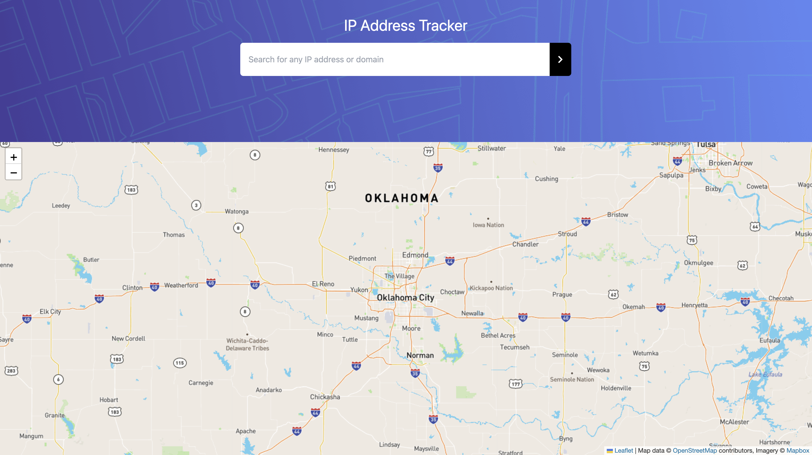

# IpAddress Tracker
## Table of contents
* [Summary](#summary)
* [Technology](#technologies)
* [Visit Website](#visit-website)
* [Contact](#contact)

Welcome to IpAddress Tracker. 

 

<kbd>

</kbd>
<kbd>

</kbd>

## Summary
  Tracking IpAddres using MapBox API and IP Geolocation api

## Technologies

### Tools 
* HTML
* CSS
* Javascript
* leaflet
* Vue JS
* Vue X for state management
* IP addresses and geospatial data
* Api calls, parsing responses and updating state (using the Axios.js library)
* Tailwind CSS for a strong and responsive design.

## Visit Website

## Contact
Created by [Pau Thawn](https://www.linkedin.com/in/pau-thawn) 
Feel free to contact me for any questions! 

